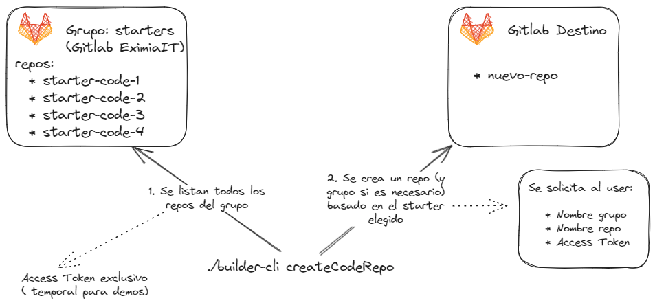

# CLI Builder 5.0

Pruebas de concepto de uso de una CLI para el builder de apps y ambientes.



## Configuración

### Build

```bash
# linux
docker build . -t builder-cli
```

```bash
# windows
docker build --build-arg TARGETOS=windows --build-arg EXT=.exe -t builder-cli-win .
```

### Ejecución

1. Extraer el binario de la imagen de docker

```bash
# bash
docker run --rm -v $(pwd)/bin:/out --entrypoint /bin/sh builder-cli -c "cp /root/builder-cli /out/"
```

```powershell
# powershell
docker run --rm --mount "type=bind,src=$($pwd)/bin,target=/out" --entrypoint /bin/sh builder-cli -c "cp /root/builder-cli.exe /out/"
```

1. Ejecutar el binario

```bash
# bash
$ .\bin\builder-cli
```

```powershell
# powershell
$ .\bin\builder-cli.exe
```
